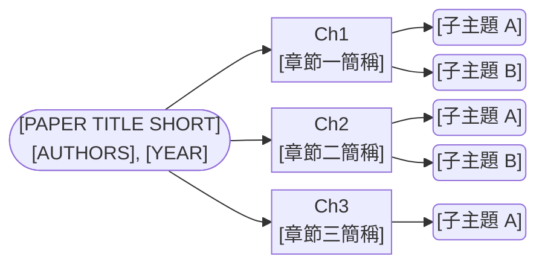
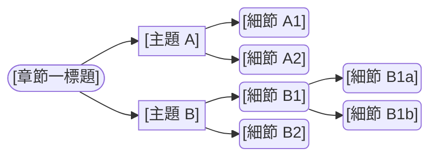

# Paper to Study Skill（理解筆記 + 中文翻譯）

將學術論文 **PDF** 轉換為兩份結構化 Markdown 檔案，相容 **VS Code Markdown Preview** 與 **Obsidian**。

## 呼叫方式

```
/paper-to-study <pdf_path>
```

未提供 pdf_path 時詢問「請提供論文 PDF 路徑（可直接拖曳至終端機）：」

**固定輸出結構**（md 檔與 PDF 同層，副產物置於 `Claude/`）：

```
論文資料夾/
├── 論文.pdf
├── Reference/                  ← 參考文獻 PDF（選用）
├── 論文簡稱_理解.md             ← 理解型筆記（與 PDF 同層）
├── 論文簡稱_翻譯.md             ← 中文翻譯（與 PDF 同層）
├── .vscode/settings.json       ← VS Code 樣式設定（放根層 VS Code 才讀得到）
└── Claude/                     ← 所有副產物
    ├── 論文.html + _files/     ← 使用者放入，僅供 metadata（選用）
    ├── img/                    ← PDF 擷取的圖 + figures.json
    ├── _extracted.txt
    └── vscode-markdown.css / obsidian-snippet.css
```

## 論文簡稱（short_title）推導規則（study / review 兩 skill 共用，保證 Obsidian 連結不斷；ppt 不參與——其輸出固定名為 PPT.pptx）

1. 同層已存在本論文的 `*_理解.md`、`*_翻譯.md` 或評讀 md（`論文簡稱.md`）→ **沿用該檔名的簡稱**，不另創。
2. 否則：從論文標題取 2–4 個最具辨識度的英文關鍵詞，以 `-` 或 `_` 相接，總長 ≤40 字元（例：`GaN-ESD-Gate-Driver`、`ESD_T-Coil_IF`）。
3. 推導時機＝Phase 0 閘門通過後、進 Phase 1 前（閘門若中止就不用推導）；決定後先印出簡稱給使用者看，之後所有檔名與 `[[連結]]` 都用同一字串。

## 套件需求（開跑前先 preflight）

| 套件 | pip 安裝名 | 用在哪 |
|---|---|---|
| pdfplumber | `pdfplumber` | Phase 0b／1a 抽 PDF 文字 |
| BeautifulSoup | `beautifulsoup4` | Phase 1b metadata 退路 |
| PyMuPDF | `PyMuPDF`（import 名 `fitz`） | extract_figures.py 抽圖／算繪 |
| Pillow | `Pillow` | import_html_figures.py（軟依賴：缺了印 `NO_HTML_FALLBACK_PDF  (Pillow 未安裝)` 並 exit 2，走 PDF 退路） |
| Playwright | `playwright`＋`playwright-stealth`，**另需執行一次 `playwright install chromium`**（下載瀏覽器二進位，純 pip 裝不夠） | ieee_downloader.py 下載參考文獻 |
| matplotlib | `matplotlib` | 僅圖片來源 (c) 自繪時 |

```python
import importlib
for m in ["pdfplumber", "bs4", "fitz", "PIL", "playwright", "playwright_stealth"]:
    try:
        importlib.import_module(m); print("[OK]", m)
    except ImportError:
        print("[MISSING]", m)
```

處置：出現 `[MISSING]` → `pip install <安裝名>` 後重試一次 → 仍失敗 → **停下回報使用者**，不要硬跑。

---

## ⚠️ 相容性規則（每份生成的檔案都必須遵守）

| 規則 | 說明 |
|------|------|
| ✅ YAML frontmatter | 每份檔案頂部必須有 `---` frontmatter |
| ✅ `<sub>` 下標 | `V_DD` → `V<sub>DD</sub>`，`VDD` 也要轉 |
| ✅ Mermaid flowchart LR | 心智圖一律用 `flowchart LR` 語法，加 init 緊湊參數 |
| ✅ Obsidian callout | 精隨與重點用 `> [!abstract]` 或 `> [!note]` |
| ✅ 相對路徑圖片 | 圖片存於 `Claude/img/`，嵌入用相對路徑（HTML 來源 `./Claude/img/figNN.png`；PDF 來源 `./Claude/img/fig_NN.png`） |
| ✅ 圖片排版 + 並排 | 所有嵌入圖一律用 ``（不用 ``）；**固定 `width="48%"`**。兩張並排＝同一段落（中間無空行）放兩個 ``、各 48%；單張＝一個 ``，**與並排時等大**（為解說方便允許並排，這點與 review 一致） |
| ✅ 標準錨點連結 | `[↑ 頂部](#top)` 格式，兩平台通用 |
| ❌ 禁用 `<style>` | 不可在 md 內嵌 style 標籤 |
| ❌ 禁用 HTML table | 文字表一律用 GFM `\| table \|`；HTML 僅限圖片排版（``） |

## 下標轉換對照表

在生成文字時（不在 code block 內），套用下列轉換：

| 原始 | 轉換後 | 原始 | 轉換後 |
|------|--------|------|--------|
| `V_DD` / `VDD` | `V<sub>DD</sub>` | `V_SS` / `VSS` | `V<sub>SS</sub>` |
| `V_t1` / `Vt1` | `V<sub>t1</sub>` | `V_h` / `Vh` | `V<sub>h</sub>` |
| `V_BD` / `VBD` | `V<sub>BD</sub>` | `V_clamp` / `Vclamp` | `V<sub>clamp</sub>` |
| `I_t2` / `It2` | `I<sub>t2</sub>` | `I_ESD` / `IESD` | `I<sub>ESD</sub>` |
| `R_on` / `Ron` | `R<sub>on</sub>` | `C_ESD` | `C<sub>ESD</sub>` |
| `L_1` | `L<sub>1</sub>` | `L_2` | `L<sub>2</sub>` |

---

## Phase 0：前置閘門 + 參考文獻下載（吸收自舊 /paper-to-Reference）

> 本 Phase 在做任何筆記前先跑。它（A）強制三項前置條件、（B）依「只補缺」原則下載 References 的 IEEE 全文 PDF 到 `Reference/`。
> **下載依賴**：學校 VPN（`ieee_downloader.py` 會自動 precheck）、skill 自帶的 `ieee_downloader.py`、Claude 的 WebSearch 工具。

### 0a. 前置閘門（一次全查、缺什麼一次報齊；任一不符 → 中止整個 paper-to-study，不生成任何筆記/翻譯）

三項條件：① `Claude/` 存在於 PDF 同層；② `Claude/` 內「恰好一個」`.html`，且有與它「同名」的 `<base>_files/` 資產夾（唯一一組乾淨 Ctrl+S 存檔）；③ `Reference/` 存在於 PDF 同層。
容許存在、不算違規：skill 自產副產物（`img/`、`*.css`、`_extracted.txt`、`.vscode/`、`figures.json`、`coverage.json`、`ieee_papers.json`、`_make_figs.py`、`_extract_text.py`、`gen_ppt.py`），以免重跑被自己上次的產物擋死。

```python
from pathlib import Path
import re

pdf_path = Path(r"<USER_PROVIDED_PDF>")
base = pdf_path.parent
claude_dir = base / "Claude"
ref_folder = base / "Reference"          # 同層唯一判定（Phase 1d 會另行自含定義同值變數）

missing = []

# ① Claude/ 存在
if not claude_dir.exists():
    missing.append("Claude/ 不存在 → 在論文 PDF 同層建立 Claude/，放入該論文 Ctrl+S 存檔（.html + 同名 _files/）")

# ② Claude/ 內唯一一組乾淨同名 Ctrl+S 存檔
if claude_dir.exists():
    htmls = sorted(claude_dir.glob("*.html"))
    files_dirs = [d for d in claude_dir.iterdir() if d.is_dir() and d.name.endswith("_files")]
    if len(htmls) == 0:
        missing.append("Claude/ 內沒有 .html → 放入該論文 Ctrl+S 存檔（.html + 同名 _files/）")
    elif len(htmls) >= 2:
        missing.append(f"Claude/ 內有 {len(htmls)} 個 .html（只能一篇）→ 只保留一篇論文的存檔")
    else:
        stem = htmls[0].stem
        if not (claude_dir / f"{stem}_files").is_dir():
            missing.append(f"{htmls[0].name} 缺對應的 {stem}_files/ 資產夾 → 重新以 Ctrl+S 完整存檔")
    # 任何 *_files 都必須有對應 .html（擋住對不上的資產夾）
    for d in files_dirs:
        s = d.name[:-6]  # 去掉 "_files"
        if not (claude_dir / f"{s}.html").exists():
            missing.append(f"{d.name} 沒有對應的 {s}.html → 移除多餘資產夾或補回 .html")

# ③ Reference/ 存在
if not ref_folder.exists():
    missing.append("Reference/ 不存在 → 在論文 PDF 同層建立 Reference/（空資料夾即可，表示要下載參考文獻）")

if missing:
    print("[STOP] /paper-to-study 前置條件未滿足，已中止（未生成任何筆記）：")
    for m in missing:
        print("  [缺] " + m)
    print("請補齊後重跑 /paper-to-study <pdf>")
    STOP = True
else:
    STOP = False
print("GATE", "STOP" if STOP else "PASS")
```

**若印出 `GATE STOP`：Claude 必須立即停止整個 paper-to-study，把上面的缺項清單回報給使用者，不執行 Phase 0b 之後與 Phase 1–4 的任何步驟。**

### 0b. 雙欄感知提取 References 章節（獨立於 1a，不覆寫 _extracted.txt）

IEEE 論文多為雙欄；直接 `extract_text()` 會左右欄交錯。逐頁 crop 左右欄再拼接：

```python
import pdfplumber              # 註：pdf_path 與 re 已於 0a 定義/匯入；pdfplumber 未裝 → 見開頭「套件需求」處置
pages_text = []
with pdfplumber.open(pdf_path) as pdf:
    for i, page in enumerate(pdf.pages):
        w, h = page.width, page.height
        left  = page.crop((0,   0, w/2, h)).extract_text() or ""
        right = page.crop((w/2, 0, w,   h)).extract_text() or ""
        combined = (left + "\n" + right).strip()
        if combined:
            pages_text.append(combined)
full_text = "\n\n".join(pages_text)
# 定位 References 標題（不分大小寫）：REFERENCES / References / Bibliography / BIBLIOGRAPHY
m = re.search(r'\n\s*(REFERENCES|References|Bibliography|BIBLIOGRAPHY)\s*\n', full_text)
refs_text = full_text[m.end():] if m else ""
print("refs_text chars:", len(refs_text))
```

### 0c. 解析 + 分類每筆 reference（由 Claude 讀 refs_text 判斷）

**識別為 IEEE 論文（需下載）——滿足任一特徵：**
`IEEE J.` / `IEEE Journal`、`IEEE Trans.` / `IEEE Transactions`、`in Proc. IEEE` / `Proc. IEEE`、`IEEE Conf.` / `IEEE Conference`、`IEEE Symp.` / `IEEE Symposium`、`IEEE EOS/ESD`、`J. Solid-State Circuits`。

**略過（不下載）：** 書籍（Cambridge / Prentice-Hall / Wiley / Springer / McGraw-Hill；含 "New York" / "Upper Saddle River"）、JEDEC/ANSI/IEC 標準（`JEP`/`JEDEC`/`ANSI`/`IEC`/`Appl. Note`）、學位論文（`Ph.D. dissertation`/`thesis`/`Master's thesis`）、技術報告（`Tech. Rep.`/`Technical Report`/`White Paper`）。

對每筆 IEEE 論文記錄：`ref`（編號字串，如 `"2"`）、`title`、第一作者姓、`year`、`venue`。彙整為 Python list `ieee_refs`（每元素含至少 `ref`、`title`、`author`）。

### 0d. 補缺 diff（只下載 Reference/ 內還沒有的）

```python
existing = set()              # 註：ieee_refs 來自 0c、ref_folder 來自 0a
for p in ref_folder.glob("*.pdf"):
    mm = re.match(r"\[(\d+)\]_", p.name)
    if mm:
        existing.add(mm.group(1))
to_download = [r for r in ieee_refs if r["ref"] not in existing]
print(f"IEEE refs: {len(ieee_refs)}, 已有: {sorted(existing)}, 待下載: {[r['ref'] for r in to_download]}")
```

若 `to_download` 為空 → **跳過 0e–0h，直接進 Phase 1**（Reference/ 已齊）。

### 0e. WebSearch 找「待下載」各篇的 IEEE Xplore URL

對 `to_download` 每篇查 IEEE Xplore URL。**派工判準**：待查 >2 筆 → 派 1 個 general-purpose subagent（model: sonnet）批次查，主對話只收「ref → URL／未找到」清單（dispatch.md §1：查網頁派工）；≤2 筆 → 主對話直接發 WebSearch（每篇至多 2 種查法、合計 ≤4 次呼叫，符合 ≤5 次例外）。每篇查法：
1. `"<標題前6字>" site:ieeexplore.ieee.org`
2. 退路：`<第一作者姓> "<標題關鍵詞>" IEEE Xplore site:ieeexplore.ieee.org`

判斷：找到 `https://ieeexplore.ieee.org/document/XXXXXXX/` → 記錄；不確定/找不到 → 記「未找到」，**不猜測**。

### 0f. 寫 ieee_papers.json（只含「待下載且已找到 URL」者）

```python
import json
papers = [{"ref": r["ref"], "title": r["title"], "url": r["url"]}
          for r in to_download if r.get("url")]
json_path = claude_dir / "ieee_papers.json"   # 副產物放論文自己的 Claude/，不污染<VAULT_ROOT>根層（claude_dir 來自 0a）
json_path.write_text(json.dumps(papers, ensure_ascii=False, indent=2), encoding="utf-8")
print("待下載並有 URL：", len(papers))
```

命名規則由腳本處理：`[ref]_標題.pdf`。

### 0g. 跑 ieee_downloader.py（skill 自帶正本）

```bash
python "<SKILLS_ROOT>\paper-to-study\ieee_downloader.py" "<pdf同層>\Claude\ieee_papers.json" "<pdf同層>\Reference"
```

`<pdf同層>\Reference` 即上面的 `ref_folder`。腳本行為：建目錄（若無）、VPN precheck、逐篇下載、輸出摘要。**機械判讀訊號（2026-07-06 讀碼實測）**：

- VPN precheck 失敗：印兩行——`[WARNING] 無法取得 IEEE 全文 PDF。`＋次行縮排的 `請先連接學校 VPN，再重新執行腳本。`，**exit code = 1**，整支腳本結束 → **中止整個 paper-to-study**，回報使用者連 VPN 後重跑，不進 Phase 1。
- VPN 正常、個別論文失敗：印 `  [FAIL] [ref] ...`，只記錄該筆、**繼續跑完**。此時 **exit code 仍為 0**——exit 0 只代表 precheck 通過，**不代表全部下載成功**，必須讀結尾摘要的失敗清單。
- 本腳本對同名檔案**無條件覆寫**、自己不做「已存在就跳過」——防重複下載完全靠 Phase 0d 的補缺 diff。**不要**把已下載的 ref 也寫進 ieee_papers.json。

### 0h. 回報下載摘要 → 進 Phase 1

```text
===== Phase 0（參考文獻）完成 =====
References 總數：XX 筆
  ├ IEEE 論文：XX 篇（已有 X、本次補下 X）
  ├ 書籍/標準/學位論文（略過）：X 筆
下載結果：[OK] 成功 X → <pdf同層>\Reference\ ｜ [FAIL] 失敗 X
無法取得 IEEE Xplore URL（需手動）：[ref] 標題 ...
```

完成後繼續 Phase 1。

**Phase 0 自查點**：輸入＝PDF 路徑。輸出＝GATE PASS 判定、（有待下載時）`Claude\ieee_papers.json` 與 `Reference\` 新增 PDF、上方下載摘要。檢查＝已印 `GATE PASS`；摘要中「成功＋失敗＋略過」筆數對得上 References 分類數；失敗與需手動清單已完整列給使用者。

---

## Phase 1：論文分析

> **輸入來源**：學術論文 PDF（直接提供路徑）
> metadata 補充：`Claude/` 內的 IEEE 存檔 .html（選用）；圖片優先取 HTML 的 `*_files/` 圖片資料夾，無則由 PDF 擷取

### 1a. 從 PDF 提取結構化文字

```python
import pdfplumber
from pathlib import Path
pdf_path = Path(r"<USER_PROVIDED_PDF>")
out_dir = pdf_path.parent              # md 放這層
claude_dir = out_dir / "Claude"        # 副產物
claude_dir.mkdir(exist_ok=True)
pages = []
with pdfplumber.open(pdf_path) as pdf:
    for i, pg in enumerate(pdf.pages):
        # IEEE 多為雙欄：與 Phase 0b 同法，左右欄分開抽再拼，避免欄位交錯
        # （_extracted.txt 是 Phase 3 全文翻譯與 1c 圖說擷取的輸入源，順序必須正確）
        w, h = pg.width, pg.height
        left  = pg.crop((0,   0, w/2, h)).extract_text() or ""
        right = pg.crop((w/2, 0, w,   h)).extract_text() or ""
        t = (left + "\n" + right).strip()
        pages.append(f"[Page {i+1}]\n{t}")
(claude_dir / "_extracted.txt").write_text("\n\n---\n\n".join(pages), encoding="utf-8")
print(f"Extracted {len(pages)} pages")
```

若 pdfplumber 未裝 `pip install pdfplumber`（或改用 PyMuPDF fitz，同樣左右欄分開取）。

### 1b. 建立論文 Schema

metadata 優先讀 `Claude/` 內的 IEEE 存檔 HTML（IEEE Xplore 把完整 metadata 內嵌在 `xplGlobal.document.metadata` JSON 物件，**不是** `<meta citation_*>` 標籤），無則退 og:title／PDF 第 1 頁推斷：

> 註：最後的「無 HTML → PDF 第 1 頁推斷」分支在本 skill 正常流程**走不到**（Phase 0 閘門保證 HTML 在場），僅保留供例外/手動情境；該分支引用的 `pages` 變數來自 1a 的 code block。

```python
from pathlib import Path
import re, json
claude_dir = pdf_path.parent / "Claude"
html_files = [h for h in claude_dir.glob("*.html")] if claude_dir.exists() else []

schema = {}
if html_files:
    txt = html_files[0].read_text(encoding="utf-8", errors="replace")
    m = re.search(r'xplGlobal\.document\.metadata\s*=\s*(\{.*?\});', txt, re.DOTALL)
    d = None
    if m:                          # IEEE Xplore 內嵌 metadata（精準、無損）
        try:
            d = json.loads(m.group(1))
        except json.JSONDecodeError:
            d = None               # JSON 截斷/異常 → 走下方 og:title 退路
    if d:
        aff = d["authors"][0].get("affiliation", []) if d.get("authors") else []
        schema = {
            "title": d.get("title", ""),
            "authors": [a.get("name") for a in d.get("authors", [])],
            "institution": "; ".join(aff) if isinstance(aff, list) else (aff or ""),
            "journal": d.get("publicationTitle", ""),
            "year": str(d.get("publicationYear", "")),
            "doi": d.get("doi", ""),
        }
    else:                          # 退路：og:title + DOI regex
        from bs4 import BeautifulSoup
        soup = BeautifulSoup(txt, "html.parser")
        og = soup.find("meta", {"property": "og:title"}) or soup.find("meta", {"name": "twitter:title"})
        dm = re.search(r'"doi"\s*:\s*"([^"]+)"', txt) or re.search(r'\b10\.\d{4,9}/\S+\b', txt)
        schema = {"title": og["content"].strip() if og and og.get("content") else "",
                  "doi": dm.group(1) if dm else "待補"}
        # 其餘欄位由 Claude 讀 HTML/PDF 補
if not schema:                     # 無 HTML → PDF 第 1 頁推斷
    m = re.search(r'Digital Object Identifier\s*([0-9.]+/\S+)', pages[0]) or re.search(r'\b10\.\d{4,9}/\S+\b', pages[0])
    schema = {"doi": (m.group(1) if m else "待補")}
    # title/authors/institution/journal/year：由 Claude 讀第 1 頁文字判斷填入；缺漏標「待補」
print(schema)
```

| 欄位 | 來源 |
|------|------|
| title / authors / institution / journal / year / doi | HTML 的 `xplGlobal.document.metadata` JSON（在場，精準）／og:title 退路／PDF 第 1 頁推斷（備援） |
| abstract | `xplGlobal.document.metadata` 的 `abstract`（HTML）／PDF 第 1 頁（備援） |
| sections | 內文 I./II./III-A. 標題 |
| figures | 內文「Fig. N」行 |

### 1c. 建立圖片對應表（**HTML 圖片資料夾優先，PDF 擷取為退路**）

圖片來源優先序：**(A) HTML 存檔的圖片資料夾（`*_files/`）→ (B) 無此資料夾時才從 PDF 直接擷取**。

#### (A) 優先：從 HTML 圖片資料夾匯入（在場時用此路）

若 `Claude\` 下有 IEEE Xplore 存檔 `*.html` 及其同名 `*_files\` 資產資料夾，跑：

```
python "<SKILLS_ROOT>\paper-to-study\import_html_figures.py" "<paperfolder>\Claude"
```

- 腳本解析 HTML 的 ``，由 **alt 取 Fig/Table 編號、src 取本地檔名**（同圖常有灰階印刷版+彩色網頁版兩變體，**優先取彩色版**，皆灰階時才比 byte 大小），轉存為 `Claude\img\figNN.png`、`Claude\img\tableN.png`，並寫 `figures.json`（每筆 `status:"html"`、含 `num`/`file`/`source`）與 `coverage.json`（`source:"html"`、`per_fig` 的 `covered_by:"html"`，**視為確定涵蓋**）。
- 判斷結果：印出 `HTML_FIGURES_OK <n>`（exit 0）代表成功，全篇圖以 `coverage.json.figs_detected` 為準、檔名為 `img/figNN.png`；印出 `NO_HTML_FALLBACK_PDF`（exit 2）代表沒有 HTML/資產夾或抓不到圖 → 改走 (B)。
- HTML 圖為論文原始向量渲染圖，**乾淨且完整（含 (a)(b)(c) 子圖）**，毋需算繪整頁、毋需裁切。嵌入前仍由 Claude **讀 `img\figNN.png` 視覺確認**對應正確的 Fig 編號（比對圖說/內文）。
- **(A) 路徑覆蓋率自查（必做）**：從 `_extracted.txt` 掃「Fig. N」取論文最大 Fig 編號與清單，對照 `coverage.json.figs_detected`——缺漏的 Fig（HTML 存檔沒載到的圖）逐一用 (B) 的 page 模式算繪補上（`extract_figures.py "<pdf>" "<paperfolder>\Claude" page <頁碼>`），全數補齊才通過。
- **study 是擷取源頭**，跑這一步即把全篇圖片＋coverage 備齊供 review/ppt 重用。

#### (B) 退路：從 PDF 直接擷取（無 HTML 圖片資料夾時）

> ⚠️ extract_figures.py 會**無條件覆寫** img/ 內的 figures.json 與 coverage.json（不檢查既有內容、不印警告）；pdf 路徑錯誤時直接丟 Python traceback。跑之前先確認：確實無 HTML 資產夾（(A) 未命中）、pdf 路徑存在。

跑 `python "<SKILLS_ROOT>\paper-to-study\extract_figures.py" "<pdf>" "<paperfolder>\Claude"` 得 `Claude\img\fig_NN.png`、`figures.json` 與 `coverage.json`：

1. **保證每個 Fig 編號都對應到影像（逐 Fig 判斷）**：腳本抽完內嵌點陣圖後，掃描各頁「Fig. N / Figure N」圖說與「Table N」表說，建立 `{Fig 編號 → 頁碼}`。以「該頁 圖說+表說 總數」對「該頁內嵌圖數」比較（表也佔影像名額，故能連帶抓出躲在表圖後面的向量圖）；任一 Fig 所在頁影像不足，就把該頁 300 DPI 算繪成 `page_N.png` 補上。判定方向安全：誤判只會多算繪一頁，不會漏掉 Fig。
2. `figures.json` 含兩種 `status`：`ok`（內嵌原圖）與 `rendered_page`（整頁算繪後備，附 `figs` 清單）。`coverage.json` 的 `per_fig.covered_by` 為 `rendered_page`（確定涵蓋）或 `embedded_candidate`（該頁有足夠內嵌圖，待 Claude 視覺對應確認）。
3. 從 `_extracted.txt` 取圖說全文 `{N: caption}`；總圖數 = `coverage.json.total_figs`。
4. 嵌入前由 Claude **讀 `img\fig_NN.png` 視覺辨識**對應 Fig 編號；向量圖則對應其 `page_N.png`。
5. **逐 Fig 覆蓋率確認（必做）**：讀 `coverage.json`，對 `per_fig` 每個 Fig——`rendered_page` 視為通過；`embedded_candidate` 須由 Claude 在該頁 `fig_NN.png` 視覺找到對應圖才通過，找不到則對其 `page` 補算繪 `extract_figures.py "<pdf>" "<paperfolder>\Claude" page <頁碼>` 再對應 `page_N.png`。每個 Fig 都對應到影像後才繼續。

**coverage.json／figures.json 兩條路徑的欄位差異（2026-07-06 讀碼實測，讀取前必看）**：

| 欄位 | PDF 路徑（extract_figures.py） | HTML 路徑（import_html_figures.py） |
|---|---|---|
| figures.json 每筆 `status` | `"ok"` 或 `"rendered_page"` | 恆為 `"html"` |
| coverage.json 頂層 `source` | **無此欄位**（`.get("source")` 會是 None） | `"html"` |
| `figs_detected`／`total_figs` | 皆有（Fig 編號清單／總數整數） | 皆有 |
| `per_fig` 每筆形狀 | `{fig, page, covered_by}` | `{fig, covered_by, file}`（**沒有 page**） |
| `per_fig.covered_by` 值 | `"rendered_page"`／`"embedded_candidate"` | `"html"`（視為確定涵蓋） |

讀 `per_fig` 先看 `covered_by` 再決定能否取 `page`；`"html"` 直接視為通過，**不可**存取 `page`。

### 1d. 偵測 Reference 資料夾

```python
# Phase 0 為前置閘門，能走到這裡代表 Reference/ 必定存在。
# 自含定義（與 Phase 0a 同值，避免依賴跨 code block 的變數殘留）：
ref_folder = pdf_path.parent / "Reference"
ref_pdfs = sorted(ref_folder.glob("*.pdf"))
has_refs = bool(ref_pdfs)
print(f"Reference PDFs: {len(ref_pdfs)} (folder={ref_folder})")
```

- 若 `has_refs = True`：Phase 2「與其他工作的關係」啟用完整分析模式。**Reference PDF 一律不進主對話**（CLAUDE.md 鐵律 6）：派 1 個 general-purpose subagent（model: sonnet）批次讀 `Reference/` 全部 PDF，每篇回報「標題｜作者/年份｜一句話貢獻｜與本論文的關係線索」，主對話只拿這張表填模板
- 若 `has_refs = False`：該區塊僅根據論文內文的 Reference list 填寫標題/年份，說明欄標記「未提供 PDF」

**Phase 1 自查點**：輸入＝PDF（＋選用 Claude/ 內 HTML）。輸出＝`Claude/_extracted.txt`、schema、`Claude/img/`＋figures.json＋coverage.json、has_refs 判定。檢查＝_extracted.txt 非空；per_fig 每個 Fig 已對應影像（1c 必做項）；schema 的 title/doi 至少一項非「待補」。

---

## Phase 2：生成 File 1 — 理解型筆記

**輸出路徑**：`pdf_path.parent / [short_title]_理解.md`（與 PDF 同層）

嚴格依照下方模板生成，不可省略任何區塊。

````
---
title: "[FULL PAPER TITLE]"
authors: ["[AUTHOR 1]", "[AUTHOR 2]"]
institution: "[INSTITUTION]"
journal: "[JOURNAL]"
year: [YEAR]
doi: "[DOI]"
tags: [paper-notes, [domain1], [domain2]]  # domain 從 ESD 領域關鍵字選（與 review 同一套，供知識樹分類）：T-coil/CDM/HBM/GaN/wireline/HS-IF/VF-TLP/SerDes/FinFET/latch-up…至少 1 個
created: [YYYY-MM-DD]
type: paper-comprehension
---

# [PAPER TITLE SHORT]

<sub>作者：[AUTHORS] ｜ [JOURNAL] [YEAR] ｜ DOI: [DOI]</sub>

---

## 核心問題與貢獻

### 作者為何寫這篇論文？

[3-5 句：什麼問題存在、現有方法為何不夠、這篇論文為何現在需要]

### 論文主要貢獻

1. [Contribution 1 — 從論文直接引用或接近原文]
2. [Contribution 2]
3. [Contribution 3]
[... 所有貢獻，完整列出]

### TL;DR

> [!abstract] 一眼看懂
> **問題**：[一句話]
> **方法**：[一句話]
> **結果 / 洞見**：[一句話]

---

## 心智圖 — Layer 0：全文架構總覽

> 只看第一層分支，掌握全局。



> **規則**：每個章節節點用 `["Ch N\n簡稱"]`（兩行），子主題用 `("文字")`（圓角），根節點用 `(["..."])`。節點文字盡量簡短（≤8字），讓整圖一屏可覽。

---

## 心智圖 — Layer 1：[章節一標題]



[對論文所有章節各生成一張 Layer N 心智圖，結構與上方相同。章節有子節（subsection）時，子節作為中間層節點展開。]

---

## 各章節精華速覽

| 章節 | 核心問題 | 關鍵答案（≤10 字） | 重要程度 |
|------|---------|-----------------|---------|
| [I. Title] | [這節回答什麼問題？] | [答案] | ★★★★★ |
| [II. Title] | [...] | [...] | ★★★★☆ |
[... 所有章節]

---

## 深度解析

[對論文每個章節，產生一個子節]

### [章節 I：中文標題]（[English Title]）

#### 核心概念

[2-4 句概念說明]

#### 技術細節

[詳細技術說明。流程/比較用 Mermaid 圖；參數比較用 GFM 表格；
非顯而易見的洞見用 > [!note] callout]

[圖片處理採兩段式邏輯，全篇嵌入圖片數量目標為論文總圖數的 **1/3** 以內：]

**一般圖片（大多數）→ 僅文字提及，不嵌入**
在說明段落中自然帶出，例如「如 Fig. X 所示，…」或「Fig. X 呈現了…」，不插入圖片語法。

**關鍵圖片（≤ 總圖數 1/3）→ 嵌入圖片**
符合以下任一條件才嵌入：
- 電路架構圖／系統方塊圖：理解整篇論文結構的核心
- 核心量測或模擬結果圖：直接支撐論文主要結論
- 若不看圖，文字說明將難以理解的圖

**嵌入格式（一律 ``，不用 ``）：**

單張：

```
**Fig. N** — [完整英文圖說]


```

兩張並排（解說對照時用；**同一段落、中間無空行**，否則不會並排）：

```
**Fig. A** — [圖說 A]　｜　**Fig. B** — [圖說 B]

 
```

> 單張與並排一律 `width="48%"`，使**單張圖大小＝並排時單張的大小**。

**並排與否（自動判斷，不問使用者）**：對「決定要嵌入的圖」逐一檢查——當**相鄰的兩張圖性質相配**就並排，否則單張。配對條件（滿足任一）：
- 同類型：兩張都是電路/架構圖，或都是量測/模擬結果圖；
- 對照關係：概念圖 ↔ 其細化/實作圖（如簡化電路 ↔ 模擬等效電路）、單一條件 ↔ 其參數掃描、before ↔ after、(a) ↔ (b) 子圖。

並排時把兩張 `` 放同一段落（中間無空行），並在圖說標「（左）」「（右）」、加一句左右對照的解說。**不相鄰、或主題不同、或為獨立概念示意圖 → 維持單張。** 跨章節的圖各自留在所屬章節，不強行並排。

圖片來源優先序（決定 src 檔名，嚴守不杜撰）：
(a) **HTML 圖（最優先，import_html_figures.py 已匯入，figures.json status: html）**→ 視覺確認 Fig 編號、內文圖說當 caption → `src="./Claude/img/figNN.png"`
(b) PDF 原圖抽到（figures.json status: ok）→ 視覺辨識 Fig 編號 → `src="./Claude/img/fig_NN.png"`
(c) 向量圖抽不到、可從文中數值/概念重建 → 寫 _make_figs.py（matplotlib，標籤英文避免 CJK 缺字）或 Mermaid 自繪，存 ./Claude/img/，標「自繪/示意」。
(d) 向量圖抽不到、為量測結果圖 → 跑 extract_figures.py 的 page 模式算繪該頁：
    python "...\paper-to-study\extract_figures.py" "<pdf>" "<paperfolder>\Claude" page <頁碼>
    → `src="./Claude/img/page_N.png"`
(e) 都不行 → 純文字提及。絕不捏造論文未提供的數據。

> 圖檔命名：HTML 來源為 `figNN.png`（兩位數補零，如 `fig05.png`）；PDF 內嵌為 `fig_NN.png`；整頁算繪為 `page_N.png`。

#### 設計洞見

> [!note] 關鍵洞見
> [這節對從業者最重要的單一洞見]

---

[對所有章節重複上述結構]

---

## 作者視角：論文的設計哲學

### 為什麼這樣設計？

[作者做了哪些根本性的設計選擇？為何選這個方向而非其他？]

### 論文的假設與局限

- **假設**：[列出主要假設]
- **局限**：[這篇論文沒有處理什麼？留給未來研究的是什麼？]

### 與其他工作的關係

#### 論文定位

[1–2 句：這篇論文在整個領域中站在哪裡？是擴展、修正、還是挑戰先前工作？]

#### 各 Reference 簡介

[若 has_refs = True：把 Phase 1d 派出的 subagent 回報表填入下表（Reference PDF 由 subagent 消化，不進主對話——CLAUDE.md 鐵律 6）；Reference/ 中沒有對應 PDF 的引用，說明欄末尾加註「(推斷)」]
[若 has_refs = False：根據論文 Reference list 填寫標題與年份，說明欄填「未提供 PDF」]

| # | 標題 | 作者 / 年份 | 這篇做了什麼（一句話） |
|---|------|-----------|----------------------|
| [1] | [標題] | [作者, 年份] | [主要貢獻一句話] |
| [2] | [標題] | [作者, 年份] | [根據論文引用脈絡推斷的貢獻](推斷) |
[... 所有 Reference，逐筆填寫]

#### 本論文與各 Reference 的具體關係

[對每一篇有 PDF 的 Reference 說明本論文如何運用它；無 PDF 者根據論文引用脈絡推斷，末尾加註「(推斷)」]

- **[1]**：[本論文建立在它的哪個結果上？用作對比基準？還是直接引用其方法？]
- **[2]**：[根據論文引用脈絡推斷的關係](推斷)
[... 所有 Reference]

#### 可行性評估

**整體評價**：[1–2 句總結這篇論文的學術或工程價值]

**做得好的地方**（至少 3 點）：
1. [具體說明——實驗設計、方法創新、結論清晰度等]
2. [...]
3. [...]

**可以再改善的地方**（至少 3 點）：
1. [具體說明——製程覆蓋範圍、對照組完整性、假設限制等]
2. [...]
3. [...]

---

## 跨章節比較總表

[綜合論文中的比較表格，或根據內容自行合成]

| 項目 | [選項 A] | [選項 B] | [選項 C] |
|------|---------|---------|---------|
| ... | ... | ... | ... |
````

**Phase 2 自查點**：輸入＝schema、_extracted.txt、figures.json/coverage.json、Reference 簡介表（subagent 回報）。輸出＝`<paperfolder>\簡稱_理解.md`。檢查＝模板區塊齊全（對照模板標題逐一點名）；心智圖數＝章節數＋1（Layer 0）；嵌入 `` 數 ≤ 總圖數 1/3；全文搜尋 `待補`、`[AUTHOR`、`TODO` 為 0 筆（涵蓋 1b schema 的裸「待補」值；原文真沒提供的欄位寫「原文未提供」並在回報說明）。

---

## Phase 3：生成 File 2 — 中文翻譯

**輸出路徑**：`pdf_path.parent / [short_title]_翻譯.md`（與 PDF 同層）

**翻譯規則**：翻譯所有句子，不得省略任何段落。專有名詞格式：中文（英文）。

````
---
title: "翻譯｜[FULL PAPER TITLE]"
authors: ["[AUTHOR 1]", "[AUTHOR 2]"]
year: [YEAR]
doi: "[DOI]"
tags: [paper-translation, [domain1]]
created: [YYYY-MM-DD]
type: paper-translation
---

# 翻譯｜[PAPER TITLE]

> **原文作者**：[AUTHORS]
> **單位**：[INSTITUTION]
> **期刊**：[JOURNAL]，[YEAR]
> **翻譯說明**：專有名詞採「中文（英文）」格式；下標用 HTML `<sub>` 標籤。

---

## 術語表（Glossary）

| 英文術語 | 中文翻譯 | 一句說明 |
|---------|---------|---------|
| [term 1] | [中文] | [說明] |
[... 萃取所有關鍵術語]

---

## 摘要（Abstract）

> [!abstract] 精隨
> [1-2 句：這篇論文最核心的主張]

[摘要完整中文翻譯——每句都翻，不省略]

---

## [I. 章節中文標題]（[English Title]）

> [!abstract] 精隨
> [1-2 句：這節涵蓋什麼、為什麼重要]

[這節完整中文翻譯]

### [I-A. 子節中文]（[English]）

> [!abstract] 精隨
> [1 句]

[子節完整中文翻譯]

---

[對所有章節重複上述結構，直到結論]

---

*翻譯整理於 [DATE]，基於 [AUTHORS], [JOURNAL] [YEAR] 全文（DOI: [DOI]）。*
````

**翻譯品質要求**：
- 所有文字皆翻，包括方程式的變數說明
- 圖片引用保留：「如圖 X 所示」
- 方程式編號保留：「（式 1）」
- 技術術語：首次出現用「中文（英文）」，後續可任一形式

**Phase 3 自查點**：輸入＝_extracted.txt（原文全文）、schema。輸出＝`<paperfolder>\簡稱_翻譯.md`。檢查＝翻譯章節數＝原文章節數；每個主要節有「精隨」callout；佔位字樣 0 筆。

---

## Phase 4：後處理

> 本 Phase 輸入＝兩份 md＋`Claude\`；輸出＝CSS×2、`<paperfolder>\.vscode\settings.json`、下標轉換後的 md；自查＝下方 4b／4c／4d 三段清單逐項打勾。

### 4a. 執行 postprocess.py

postprocess.py 與此 SKILL.md 在同一目錄。

```bash
python "<SKILLS_ROOT>\paper-to-study\postprocess.py" "<paperfolder>" "<paperfolder>\Claude" "<paperfolder>\簡稱_理解.md" "<paperfolder>\簡稱_翻譯.md"
```

參數說明：
- 第一參數：**論文資料夾根層 `<paperfolder>`**——`.vscode/` 建在這裡（VS Code 以根層開資料夾才讀得到 settings；`markdown.styles` 會自動算成 `./Claude/vscode-markdown.css`）。**不要填 `<paperfolder>\Claude`**：那是 2026-07-06 前的錯誤跑法，會讓樣式路徑多繞一層而靜默失效
- 第二參數：CSS 輸出位置＝`<paperfolder>\Claude`
- 第三、四參數：兩份 .md 的完整路徑（根層，與 PDF 同層；postprocess.py 對這兩檔執行下標轉換與 style 清理）
- 舊論文資料夾若已有 `Claude\.vscode\`，是失效路徑的遺留：不必理會、也不要主動刪

此腳本執行：
- 下標轉換（V_DD / VDD → `V<sub>DD</sub>`，跳過 code block）
- 移除誤加的 `<style>` 標籤
- 生成 `<paperfolder>\Claude\vscode-markdown.css`
- 生成 `<paperfolder>\Claude\obsidian-snippet.css`
- 建立 `<paperfolder>\.vscode\settings.json`（**論文根層**），`markdown.styles` 指向 `./Claude/vscode-markdown.css`

### 4b. 驗證 Mermaid 語法

- 所有心智圖均為 `flowchart LR`，頂部帶 `%%{init:{'flowchart':{'nodeSpacing':8,'rankSpacing':35,'padding':3}}}%%`
- 所有節點 ID 均有效，邊連接的節點均已在圖中定義
- 節點標籤內無未閉合的括號或引號
- Layer 0 的章節節點文字 ≤ 8 字（含換行），確保一屏可覽

### 4c. 驗證圖片路徑

對每個 `` 確認：
- src 格式為 `./Claude/img/圖檔名`（使用固定的 `Claude/img/` 資料夾名）
- 一律帶 `width="48%"`（單張與並排等大）；並排兩圖在同一段落、中間無空行
- 不含任何 URL 編碼（`%20` 等）
- 檔案確實存在於 `Claude/img/` 資料夾內

### 4d. 最終清單

- [ ] Phase 0 前置閘門通過：Claude/ 存在且內含唯一一組乾淨同名 Ctrl+S 存檔（.html + _files/）、Reference/ 存在（缺任一應已中止、不應走到這裡）
- [ ] Phase 0 下載採「只補缺」：未重抓 Reference/ 內既有的 [ref]_*.pdf
- [ ] 兩份檔案均有 YAML frontmatter
- [ ] 無 `<style>` 區塊
- [ ] 所有下標使用 `<sub>` 標籤
- [ ] File 1 有 Layer 0 全文總覽心智圖（flowchart LR）
- [ ] File 1 有各章節各一張 Layer N 心智圖
- [ ] File 2 每個主要節有 精隨 callout
- [ ] `vscode-markdown.css` 和 `obsidian-snippet.css` 存在於 `Claude/`
- [ ] `.vscode/settings.json` 存在於**論文根層**，`markdown.styles` 指向 `./Claude/vscode-markdown.css`
- [ ] 兩份 md 全文搜尋佔位字樣（`待補`／`[AUTHOR`／`TODO`）＝0 筆，或已在回報中列明原因
- [ ] 嵌入圖片數量 ≤ 論文總圖數的 1/3；其餘以「如 Fig. X 所示」文字帶過
- [ ] 嵌入的圖片屬於架構圖、核心結果圖，或不看圖文字難以理解的圖
- [ ] 所有嵌入圖用 ``（非 ``）；單張與兩張並排皆 48%（單張＝並排時等大）；並排兩圖在同一段落、中間無空行
- [ ] md 在 PDF 同層、副產物於 Claude/
- [ ] 圖片來源正確：有 HTML `*_files\` 時由 import_html_figures.py 匯入（figNN.png），否則才由 extract_figures.py 從 PDF 擷取（fig_NN.png）；皆落於 Claude/img/
- [ ] 嵌入圖已視覺辨識正確對應 Fig 編號
- [ ] `` 的 src 格式為 `./Claude/img/圖檔名`，不含 URL 編碼
- [ ] 「與其他工作的關係」包含：Reference 簡介表、具體關係說明、可行性評估（含優缺點）
- [ ] 若有 Reference/ 資料夾：每篇 PDF 均已由 subagent 批次讀取（鐵律 6，不進主對話），表格無空白說明欄

### 4e. 告知使用者 Obsidian 設定

完成後顯示：

```
[OK] File 1 (理解型筆記): <paperfolder>\論文簡稱_理解.md
[OK] File 2 (中文翻譯):   <paperfolder>\論文簡稱_翻譯.md
[OK] 圖片資料夾:          <paperfolder>\Claude\img\
[OK] CSS files:           <paperfolder>\Claude\vscode-markdown.css
                          <paperfolder>\Claude\obsidian-snippet.css
[OK] VS Code settings:    <paperfolder>\.vscode\settings.json
                          markdown.styles -> ./Claude/vscode-markdown.css

Obsidian 白底設定（手動）：
   1. 設定 → 外觀 → CSS 程式碼片段 → 開啟資料夾
   2. 將 Claude\obsidian-snippet.css 複製進去
   3. 回到設定，啟用該 snippet
```
